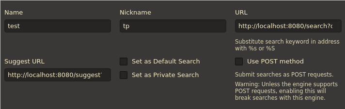
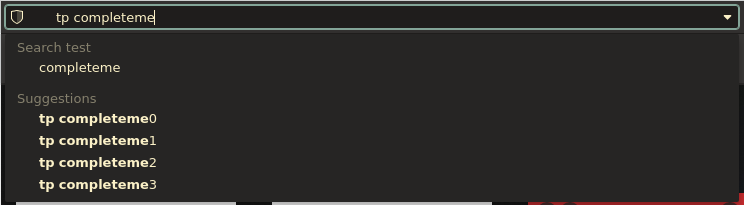

# Search engine query suggestions test

This app accepts query at `GET localhost:8080/suggest?q=%s` where `%s` is string to complete and returns list of possible completions in browser friendly format.

It's only test so suggestions will always be `%s` with numbers 0 to 3 appended

Chi is used for simplicity and is a total overkill for this application

## Motivation
Query suggestions are widely used on commerial websites. This implementation is good enough where there's no need for additional informations like tags or categories.  Conveniently it can be used in browser's omnibox if needed. 

## Setup in vivaldi

